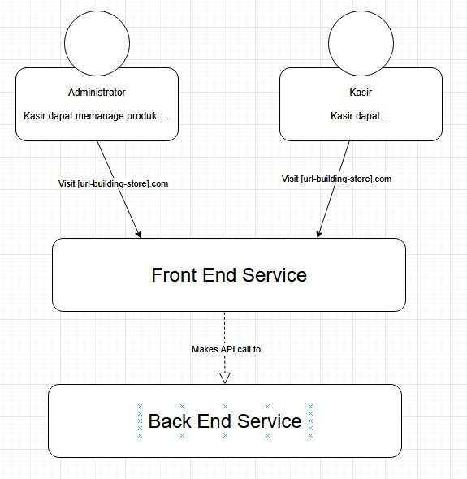
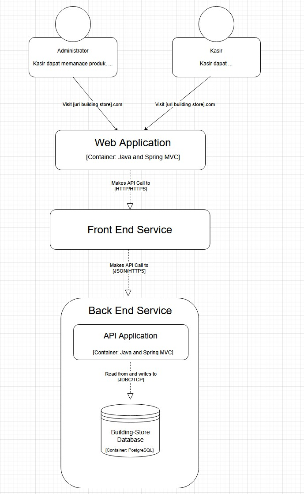
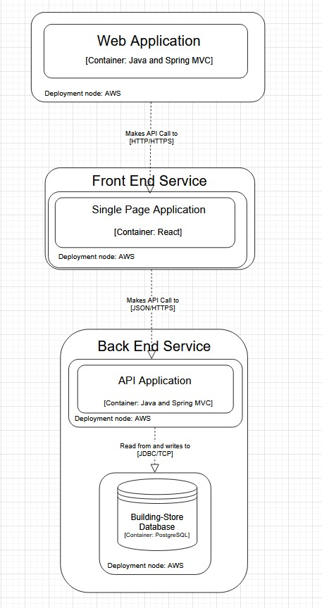
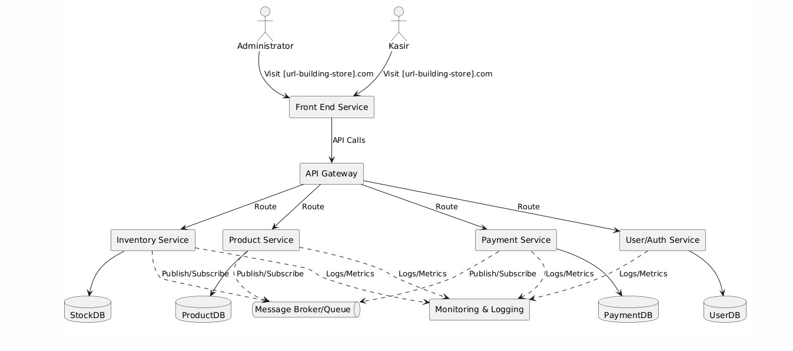

# Final Project 'Building Store' - BE

1.  Humam Al-labib (2206081755) - Manajemen Pelanggan
2.  Rifqisyandi Khairurrizal (2306152216) - Manajemen Supplier
3.  Nadya Aysha (2206081635) - Transaksi Penjualan
4.  Daffa Rayhan Ananda (2306152235) - Manajemen Pembayaran
5.  William Alexander (2306226914) - Manajemen Produk

### 1. Current Architecture
#### Context Diagram

#### Container Diagram

#### Deployment Diagram

## Risk Analysis

As the Building Store project grows and achieves greater success, several architectural risks may arise:

- **Scalability Bottlenecks:** The current architecture may not handle a large number of users or transactions efficiently, leading to slow response times or downtime.
- **Single Point of Failure:** If the backend service fails, the entire system becomes unavailable to all users.
- **Data Consistency Issues:** With increased concurrent access, maintaining accurate and consistent data (especially for inventory and payments) becomes more challenging.
- **Security Vulnerabilities:** More users and integrations increase the risk of data breaches, unauthorized access, and fraud.
- **Difficult Maintenance and Deployment:** A monolithic backend makes it harder to update or deploy features independently, increasing the risk of downtime during updates.
- **Integration Complexity:** As the system integrates with more third-party services (e.g., payment gateways, suppliers), managing and monitoring these integrations becomes more complex.

To address these risks, we applied the **Risk Storming** technique to collaboratively identify, discuss, and prioritize architectural risks. This process guided us to design a more modular, scalable, and resilient future architecture.

### 2. Future Architecture

### 3. Explanation of Risk Storming

Risk Storming was applied to proactively identify and address potential architectural risks as our project scales. By collaboratively brainstorming risks, our team was able to uncover hidden vulnerabilities and prioritize them based on their impact and likelihood. This technique ensured that we considered a wide range of possible issues—from scalability and security to integration and maintainability—before they could threaten the system. As a result, Risk Storming guided us to design a more modular, resilient, and future-proof architecture, supporting the long-term success and reliability of the Building Store project.