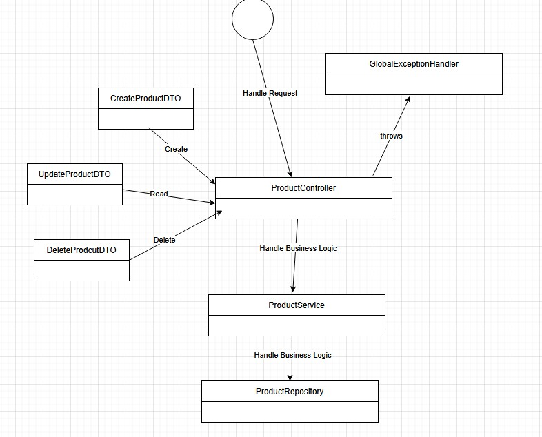
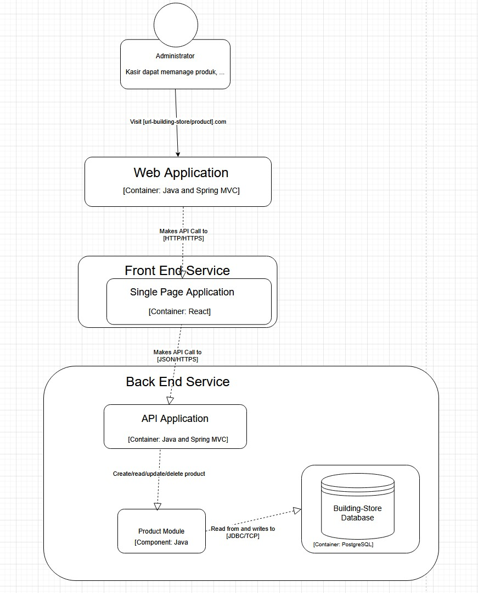

# Final Project 'Building Store' - BE

1.  Humam Al-labib (2206081755) - Manajemen Pelanggan
2.  Rifqisyandi Khairurrizal (2306152216) - Manajemen Supplier
3.  Nadya Aysha (2206081635) - Transaksi Penjualan
4.  Daffa Rayhan Ananda (2306152235) - Manajemen Pembayaran
5.  William Alexander (2306226914) - Manajemen Produk


# API Documentation

## 1. Create Product

**API Request**
|    Tipe     |         Value         |
| ----------- |:---------------------:|
| HTTP Method |          POST         |
| URL         |    /product/create    |

**Request Headers Sample**
|      Key      |          Value           |
| ------------- |:------------------------:|
| Authorization | Bearer _&lt;JWT Token&gt;_ |

**Request Body**
```
{
  "productName": "<name>",
  "productDescription": "<description>",
  "productPrice": “<price>”,
  "productStock": ” <stock>”,
}
```

**API Response**
|    Tipe     |         Value         |
| ----------- |:---------------------:|
| HTTP Status |          201          |
| Result      |         Created       |

**Response Body Sample**
```
{
   "message”: “New product is created successfully”
}
```

## 2. View Products

**API Request**
|    Tipe     |         Value         |
| ----------- |:---------------------:|
| HTTP Method |          GET          |
| URL         |    /product/    |

**Request Headers Sample**
|      Key      |          Value           |
| ------------- |:------------------------:|
| Authorization | Bearer _&lt;JWT Token&gt;_ |

**Request Body** 
```
```

**API Response**
|    Tipe     |         Value         |
| ----------- |:---------------------:|
| HTTP Status |          200          |
| Result      |         Success       |

**Response Body Sample**
```
{
    {
      "id": <UUID>,
      "name": "Semen Portland Tipe 1",
      "description": "Semen berkualitas tinggi untuk konstruksi bangunan",
      "price": 75000,
      "stock": 100,
    },
    {
      "id": <UUID>,
      "name": "Cat Dinding Premium",
      "description": "Cat dinding dengan daya tahan tinggi",
      "price": 150000,
      "stock": 50,
    }
  ]
}

```


## 3. Detail Product

**API Request**
|    Tipe     |         Value         |
| ----------- |:---------------------:|
| HTTP Method |          GET          |
| URL         |    /product/detail/&lt;_uuid_&gt;    |

**Request Headers Sample**
|      Key      |          Value           |
| ------------- |:------------------------:|
| Authorization | Bearer _&lt;JWT Token&gt;_ |

**Request Body** 
```
```

**API Response**
|    Tipe     |         Value         |
| ----------- |:---------------------:|
| HTTP Status |          200          |
| Result      |         Success       |

**Response Body Sample**
```
{
    "id": <UUID>,
    "name": "Semen Portland Tipe 1",
    "description": "Semen berkualitas tinggi untuk konstruksi bangunan",
    "price": 75000,
    "stock": 100,
}
```

## 4. Update Product

**API Request**
|    Tipe     |         Value         |
| ----------- |:---------------------:|
| HTTP Method |          PUT          |
| URL         |    /product/update/&lt;_uuid_&gt;    |

**Request Headers Sample**
|      Key      |          Value           |
| ------------- |:------------------------:|
| Authorization | Bearer _&lt;JWT Token&gt;_ |

**Request Body**
```
{
  "newProductName": "<name>",
  "newProductDescription": "<description>",
  "newProductPrice": “<price>”,
  "newProductStock": ” <stock>”,
}
```

**API Response**
|    Tipe     |         Value         |
| ----------- |:---------------------:|
| HTTP Status |          200          |
| Result      |         Success       |

**Response Body Sample**
```
{
   "message”: “Product is updated successfully”
}

```

## 5. Delete Product

**API Request**
|    Tipe     |         Value         |
| ----------- |:---------------------:|
| HTTP Method |        DELETE         |
| URL         |    /product/delete/&lt;_uuid_&gt;    |

**Request Headers Sample**
|      Key      |          Value           |
| ------------- |:------------------------:|
| Authorization | Bearer &lt;_JWT Token_&gt; |

**Request Body**
```
```

**API Response**
|    Tipe     |         Value         |
| ----------- |:---------------------:|
| HTTP Status |          200          |
| Result      |         Success       |

**Response Body Sample**
```
{
   "message”: “Product is deleted successfully”
}

```

# Software Architecture
### 4. Individu - William Alexander
#### Code Diagram

#### Component Diagram
